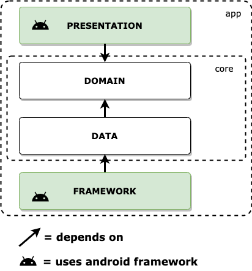

# Android News
Clean architecture sample in android.  
The app is a simple news articles adapter using data from a external api,  
it persists articles for offline use.

The user can:  
(a) view article in browser  
(b) fetch more articles by pull-to-refresh  
(c) delete unwanted articles by swiping

### Architecture
The application consists of 4 layers:  

Layer | Contains
--- | ---
Presentation | User interface, presentation logic and navigation
Domain | Entities, interactors and repository definitions
Data | Repository implementations and data source definitions
Framework | Data source implementations, dependency injection, others  

### Dependencies
type | libraries
--- | ---
ui | recyclerview, swiperefreshlayout, viewmodel
di | dagger.hilt
persistence | room
network | retrofit, moshi
browser | chrome.customtabs
async | kotlinx.coroutines, flow, stateflow
test | androidx.test, robolectric, mockk, espresso, truth, mockwebserver
